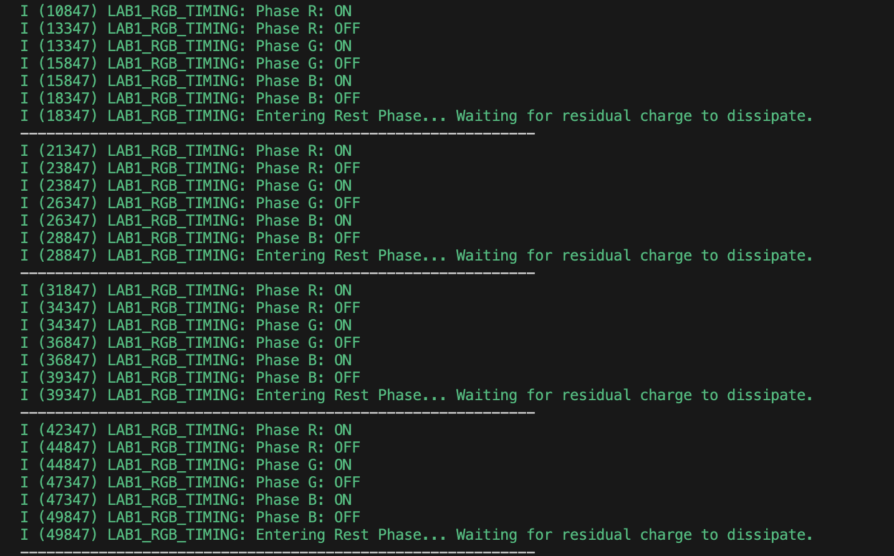
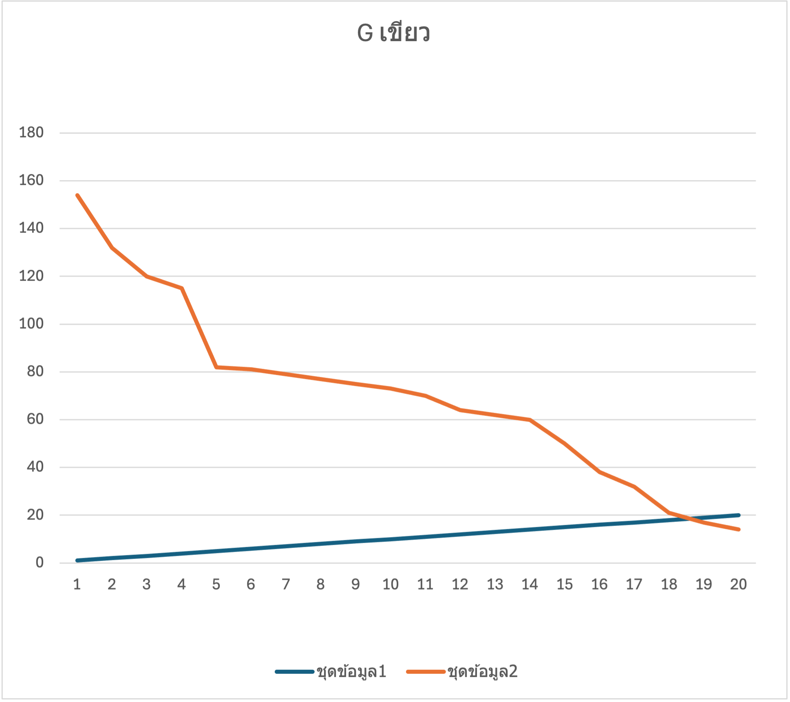
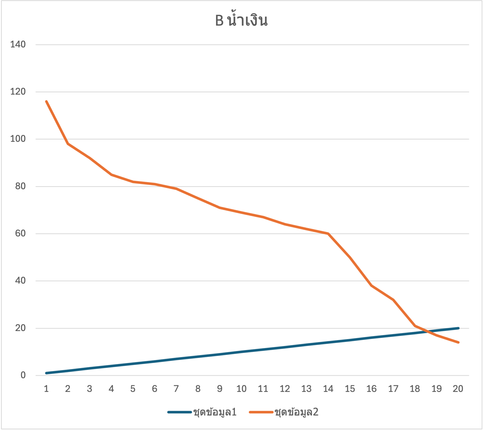
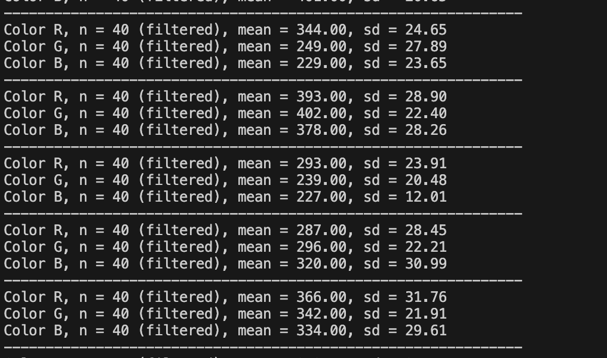

# รายงานการทดลองสัปดาห์ที่ 4: LED and Color Sensing

---

## Week-04-Lab-1

### 4. บันทึกผลการทดลอง

#### 4.1 ผลจากการทำงานของ Serial Monitor (`idf.py monitor`)

#### 4.2 ผลจากการสังเกตพฤติกรรมฮาร์ดแวร์ LED

LED สามสี (แดง เขียว น้ำเงิน) ติดและดับสลับทีละสีไล่ลำดับกันไปเรื่อย ๆ (Red $\rightarrow$ Green $\rightarrow$ Blue) โดยสว่างสีละ 2.5 วินาที เมื่อกะพริบครบทั้ง 3 สี ระบบจะเข้าสู่ช่วงพัก (Rest Phase) เป็นเวลา 3 วินาที แล้วจึงเริ่มกะพริบใหม่อีกครั้งเป็นวงรอบ

[วิดีโอการกะพริบของ LED (YouTube Shorts)](https://youtube.com/shorts/91rThC4YhEg)

---

## Week-04-Lab-2

### กิจกรรมวิเคราะห์ผลและการบ้านท้ายใบงาน (Data Science & Engineering Reflection)

#### 1. การพล็อตพฤติกรรมทางกายภาพ (Transient Response Curve)

จากการคัดลอกชุดข้อมูลคู่อันดับ `No, ADC Raw` (จำนวน 1–20 แซมเปิล) จาก Serial Monitor นำไปพล็อตเป็นกราฟเส้น (Line Chart) ใน Microsoft Excel / Google Sheets โดยให้แกน X เป็นลำดับแซมเปิล และแกน Y เป็นค่าดิบของ ADC ได้ผลการทดลองดังนี้:

##### กราฟแสดงพฤติกรรมชั่วคราวไฟสีแดง (Red Transient Response)

##### กราฟแสดงพฤติกรรมชั่วคราวไฟสีเขียว (Green Transient Response)

##### กราฟแสดงพฤติกรรมชั่วคราวไฟสีน้ำเงิน (Blue Transient Response)

---

#### 2. คำถามนำเพื่อการวิเคราะห์เชิงระบบ (Critical Thinking)

##### คำถาม 2.1
**จากกราฟที่พล็อตออกมา นักศึกษาสังเกตเห็นแนวโน้มตัวเลขของค่า ADC ตั้งแต่แซมเปิลที่ 1 ไต่ระดับลงมาหรือขึ้นไปจนถึงแซมเปิลที่ 20 อย่างไร?**

> **คำตอบ:**
> 
> สามารถแบ่งพฤติกรรมของสัญญาณอนุกรมเวลาออกเป็น 4 เฟสหลัก ได้ดังนี้:
> 
> 1. **แซมเปิลที่ 1 (จุดเริ่มต้น / Initial Peak):** มีค่า ADC สูงที่สุด (เช่น $\sim 116$ ในชุดสีน้ำเงิน และ $\sim 154$ ในชุดสีเขียว) เกิดขึ้นทันทีหลังจากดับไฟ LED ภาคส่ง เนื่องจากยังมีประจุไฟฟ้าสะสมตกค้างบนรอยต่อ PN ของ LED ภาครับในระดับสูง
> 2. **ช่วงแซมเปิลที่ 1–5 (Transient Phase):** ค่า ADC ดิ่งลดลงอย่างรวดเร็ว (มีความลาดเอียงสูง / High Slope) เกิดจากการคายประจุสะสมฉับพลัน (Rapid Discharge)
> 3. **ช่วงแซมเปิลที่ 6–14 (Gradual Discharge Phase):** อัตราการลดลงของค่า ADC เริ่มชะลอความเร็วลง มีความลาดเอียงลดลงและค่อย ๆ ลาดลงอย่างสม่ำเสมอ
> 4. **ช่วงแซมเปิลที่ 15–20 (Settling / Steady State Phase):** ค่า ADC ลดต่ำลงจนเข้าสู่ระดับแรงดันออฟเซตขั้นต่ำ (ประมาณ 14–20 บิตดิบ) และเริ่มราบเรียบนิ่งเข้าสู่สภาวะคงตัว (Steady State)

##### คำถาม 2.2
**สัญญาณไฟฟ้าเข้าสู่ความนิ่ง (Settling) ที่แซมเปิลใด หรือใช้เวลากี่มิลลิวินาที?**

> **คำตอบ:**
> 
> - **ตำแหน่งแซมเปิลที่สัญญาณนิ่ง:** สัญญาณไฟฟ้าเริ่มเข้าสู่สภาวะนิ่ง (Settling Phase) ที่ **แซมเปิลที่ 15 ถึง 18**
> - **ระยะเวลาที่ใช้:** เนื่องจากโปรแกรมตั้งค่าช่วงหน่วงเวลาสุ่มอ่านไว้ที่ $160 \text{ ms}$ ต่อแซมเปิล (`SAMPLING_DELAY_MS = 160`)
>   - แซมเปิลที่ 15 คิดเป็นเวลา: $15 \times 160 \text{ ms} = 2,400 \text{ ms}$ ($2.4$ วินาที)
>   - แซมเปิลที่ 18 คิดเป็นเวลา: $18 \times 160 \text{ ms} = 2,880 \text{ ms}$ ($2.88$ วินาที)
>   - เมื่อสุ่มจนครบ 20 แซมเปิล รวมเวลาสุ่มอ่านทั้งสิ้น $20 \times 160 \text{ ms} = 3,200 \text{ ms}$ ($3.2$ วินาที)

##### คำถาม 2.3
**ความลาดเอียงของเส้นกราฟที่เกิดขึ้นในช่วงแรกของการสลับสถานะไฟนี้ เป็นหลักฐานเชิงประจักษ์สะท้อนข้อจำกัดคุณสมบัติทางกายภาพใดของรอยต่อ PN บน LED ภาครับ และโครงสร้างตัวเก็บประจุสุ่มสัญญาณภายในไมโครคอนโทรลเลอร์?**

> **คำตอบ:**
> 
> 1. **ข้อจำกัดของรอยต่อ PN บน LED ภาครับ (High Internal Impedance & Junction Capacitance):**
>    - LED ภาครับเมื่อถูกใช้งานใน Photovoltaic Mode จะสร้างกระแสไฟฟ้าออกมาน้อยมาก (ระดับ nanoamperes: $\text{nA}$) ส่งผลให้มีความต้านทาน/อิมพีแดนซ์ภายในทางไฟฟ้า ($R_{int}$) สูงมหาศาล
>    - รอยต่อ PN มีความจุไฟฟ้าภายใน ($C_j$) เมื่อเชื่อมต่อกับขา ADC จะเกิดค่าคงที่เวลาทางไฟฟ้า ($RC \text{ Time Constant: } \tau = R_{int} \times C_j$) ที่มีค่าสูงมาก ทำให้แรงดันไฟฟ้าสะสมไม่สามารถลดลงเป็น $0\text{V}$ ได้ทันทีเมื่อปิดไฟ แต่ต้องใช้เวลาในการคายประจุ (Discharge) นานหลายวินาที
> 
> 2. **ข้อจำกัดของตัวเก็บประจุสุ่มสัญญาณภายในไมโครคอนโทรลเลอร์ (ADC Sample-and-Hold Capacitor: $C_{sample}$):**
>    - โมดูล ADC ภายใน ESP32 มีวงจรตัวเก็บประจุสุ่มสัญญาณและถือครองค่า ($C_{sample}$) ซึ่งต้องทำการชาร์จ/คายประจุให้เท่ากับระดับแรงดันอนาล็อกภายนอกขณะทำการสุ่มวัด
>    - เนื่องจากแหล่งจ่ายสัญญาณ (LED ภาครับ) มีอิมพีแดนซ์สูง การถ่ายเทประจุเข้า/ออกจาก $C_{sample}$ จึงทำได้ช้า ทำให้ระดับแรงดันที่ ADC อ่านได้ในแต่ละแซมเปิลช่วงแรกเกิดการหน่วงและค่อย ๆ ตกตามการคายประจุจริงของระบบ

##### คำถาม 2.4
**หากในใบงานถัดไปเราต้องการ "หาค่าเฉลี่ยของระดับแรงดันสะท้อนที่แท้จริง" โดยไม่ให้เฟสสัญญาณที่กำลังเปลี่ยนแปลง (Transient State) นี้ไปดึงค่าสถิติให้เพี้ยน นักศึกษาคิดว่าเราควรเลือกแซมเปิลช่วงใดมาคำนวณ หรือควรเขียนโปรแกรมหน่วงเวลาหลบเลี่ยงอาการ Settling นี้อย่างไร?**

> **คำตอบ:**
> 
> - **การเพิ่ม Pre-Sampling Delay (หน่วงเวลาก่อนสุ่มวัด):** หลังสั่งสลับสถานะไฟ LED (เปิด/ปิดไฟ) ควรเพิ่มคำสั่งหน่วงเวลาด้วย `vTaskDelay()` หรือ `esp_rom_delay_us()` ประมาณ $2,000 - 2,500 \text{ ms}$ ($2.0 - 2.5$ วินาที) ก่อนเริ่มสั่งให้ ADC อ่านค่า เพื่อรอให้ประจุตกค้างในรอยต่อ PN คายออกจนหมดและเข้าสู่ Settling Phase ก่อนทำการสุ่มวัด
> - **การประยุกต์ใช้ Trimmed Mean Filtering:** ทำการสุ่มอ่านข้อมูลหลายแซมเปิลหลังจากพ้นช่วงหน่วงเวลา นำมาจัดเรียงลำดับ (Sort) และทำการตัดค่าขอบบน-ขอบล่าง (เช่น Cut-off $10\% - 20\%$) ออก เพื่อกำจัดค่าผิดปกติ (Spike Noise) และแรงดันคายประจุตกค้างในช่วงแรก ให้ได้ข้อมูลที่สะอาดและเที่ยงตรงที่สุด

---

## Week-04-Lab-3

### 4. รายงานการทดลองและเกณฑ์การตรวจแล็บ

#### 1. การคัดกรองข้อมูลคุณภาพ (Data Selection Report)

จากการสังเกตค่าสถิติที่แสดงผลบน Serial Monitor เลือกรอบข้อมูลที่ผ่านเกณฑ์คุณภาพทางวิศวกรรม (ค่า $SD$ ต่ำสอดคล้องกันทุกเฟสสี อยู่ในช่วง $2.00 - 35.00$ และไม่มีค่าเฉลี่ยหรือค่า $SD$ เป็น $0.00$) ได้ผลดังตาราง:

---

#### 2. คำถามเชิงวิเคราะห์ (Engineering Evaluation)

##### คำถาม 2.1
**หลังจากเปลี่ยนสถาปัตยกรรมซอฟต์แวร์มาใช้ระบบกรองบิตดิบแบบ `Trimmed Mean` ก่อนทำการแปลงแรงดัน เปรียบเทียบกับพฤติกรรมอนุกรมเวลาในใบงานที่ 2 แล้ว ค่าความผันผวน ($SD$) มีการพัฒนาไปในทางที่ดีขึ้นอย่างไร?**

> **คำตอบ:**
> 
> 1. **พฤติกรรมอนุกรมเวลาเดิมในใบงานที่ 2 (Raw Time-Series Data):**
>    สัญญาณบิตดิบมีลักษณะเป็นกราฟคายประจุช่วง Transient Phase ที่ดิ่งลงอย่างรวดเร็ว (จากระดับร้อยลดลงเหลือเพียงหลักสิบ) ส่งผลให้ค่าส่วนเบี่ยงเบนมาตรฐาน ($SD$) พุ่งสูงมาก สัญญาณมีความผันผวนรุนแรง และดึงค่าเฉลี่ย (Mean) ให้คลาดเคลื่อนไปจากระดับแรงดันที่แท้จริง
> 
> 2. **พัฒนาการหลังปรับใช้ Trimmed Mean Filtering (Filtered Statistical Data):**
>    ค่าความผันผวน ($SD$) มีพัฒนาการดีขึ้นอย่างชัดเจน โดยค่า $SD$ ลดลงและเสถียรขึ้นมาเกาะกลุ่มแน่นอยู่ในช่วงเพียง **12.01 ถึง 31.76** (ผ่านเกณฑ์คุณภาพวิศวกรรมที่กำหนดไว้ $2.00 - 35.00$ อย่างสมบูรณ์) สะท้อนให้เห็นว่า:
>    - **ข้ามพ้นช่วง Transient Period:** การหน่วงเวลาให้ระดับแรงดันเสถียรร่วมกับการตัดข้อมูลขอบบน-ขอบล่าง ($10\%$) ช่วยกำจัดสัญญาณรบกวนแบบสไปค์ (Spike Noise) และแรงดันคายประจุตกค้างในช่วงแรกออกไปได้อย่างสมบูรณ์
>    - **สกัดสัญญาณรบกวนภายนอก:** ช่วยกรอง Ambient Noise จากแสงแวดล้อมและการกระพริบของไฟบ้าน 50 Hz ออกไปได้อย่างมีประสิทธิภาพ
>    - **ได้สัญญาณที่มีความแม่นยำสูง (High Precision):** สามารถเปลี่ยนสัญญาณอนุกรมเวลาที่ผันผวนรุนแรง ให้กลายเป็นเวกเตอร์สัญญาณอนาล็อกที่มีความนิ่ง เสถียร และมีความน่าเชื่อถือสูง พร้อมนำไปประมวลผลต่อในขั้นตอนถัดไป

##### คำถาม 2.2
**ในการนำข้อมูลดิจิทัลนี้ไปใช้ควบคุมหุ่นยนต์แยกแยะวัตถุสีในโลกจริง เหตุใดการระบุหน่วยวัดร่วมประมวลผลในรูปของ แรงดันทางกายภาพ (mV) จึงมีความสำคัญและเสถียรมากกว่าการใช้ข้อมูลระดับบิตดิจิทัลดิบ (Raw Scale 0-4095) ตรง ๆ? ให้แปรผลโดยอิงความรู้จากเนื้อหาในหัวข้อตำราเรียนเรื่อง "สองโลกที่แตกต่าง"**

> **คำตอบ:**
> 
> 1. **สอดคล้องกับฟิสิกส์ในโลกกายภาพ (Physical Reality & Photovoltaic Effect):**
>    ใน "โลกกายภาพ (Physical World)" ปริมาณโฟตอนจากแสงสะท้อนจะกระตุ้นรอยต่อ PN บน LED ให้สร้างแรงดันไฟฟ้ากระแสตรง (DC Voltage) ตกคร่อมขั้วโดยตรงจากปรากฏการณ์ Photovoltaic Effect การใช้หน่วยมิลลิโวลต์ (mV) จึงเป็นการอ้างอิงระดับพลังงานแสงเชิงฟิสิกส์ที่แท้จริง ต่างจากค่า Raw Bit ($0–4095$) ซึ่งเป็นเพียงตัวเลขตัวแทนใน "โลกดิจิทัล (Digital World)" ที่แผลงมาจากความละเอียดของฮาร์ดแวร์
> 
> 2. **ชดเชยความไม่เป็นเชิงเส้นและข้อบกพร่องของ ADC (Non-Linearity & Calibration Compensation):**
>    โมดูลแปลงสัญญาณ ADC (โดยเฉพาะในชิป ESP32) มีข้อจำกัดทางฮาร์ดแวร์ คือมีความไม่เป็นเชิงเส้น (Non-linearity) และเกิดการอิ่มตัว (Saturation) บริเวณขอบแรงดันต่ำ (ใกล้ $0\text{V}$) และขอบแรงดันสูง (ใกล้ $3.3\text{V}$) รวมถึงมีความคลาดเคลื่อนเฉพาะตัวของชิปแต่ละตัว (Chip-to-Chip Variation) การนำ Raw Bit มาแปลงผ่านกระบวนการ Calibrate (`adc_cali_raw_to_voltage()`) ให้เป็นหน่วย $\text{mV}$ จะช่วยชดเชยค่า Gain/Offset Error ทำให้ได้ค่าอนาล็อกที่เป็นเชิงเส้น แม่นยำ และเป็นตัวแทนความเข้มแสงที่เที่ยงตรง
> 
> 3. **ความทนทานและการพกพาอัลกอริทึม (Interoperability & Code Portability):**
>    หากในอนาคตมีการเปลี่ยนไมโครคอนโทรลเลอร์ที่ใช้ควบคุมหุ่นยนต์ (เช่น เปลี่ยนจาก ESP32 ADC 12 บิต ไปเป็น STM32 16 บิต หรือ Arduino 10 บิต) ค่าบิตดิบ Raw Scale จะเปลี่ยนไปทั้งหมด ($0–4095$ vs $0–65535$ vs $0–1023$) ทำให้ค่าขีดเริ่มเปลี่ยน (Threshold) ในการแยกแยะสีของหุ่นยนต์พังทลายทันที
>    แต่ถ้าโปรแกรมประมวลผลด้วยหน่วยแรงดันกายภาพ ($\text{mV}$) โค้ดและเงื่อนไขการตัดสินใจ (Threshold Logic) จะยังคงใช้งานได้สม่ำเสมอทันที เพราะระดับแรงดันตกคร่อมรอยต่อ PN จากวัตถุสีเดียวกันในโลกกายภาพย่อมมีค่าเท่าเดิมเสมอ ไม่ว่าจะอ่านด้วย MCU ตัวใดก็ตาม
> 
> 4. **ความเสถียรของลายนิ้วมือเชิงแสง (Stable Optical Fingerprint Vector):**
>    เมื่อนำข้อมูลอนาล็อกที่แปลงเป็น $\text{mV}$ และผ่านการกรอง Trimmed Mean มาสร้างเป็นเวกเตอร์แรงดันสะท้อน $\mathbf{V} = [V_R, V_G, V_B]$ จะได้ "ลายนิ้วมือเชิงแสง" ของวัตถุที่นิ่ง เสถียร ทนทานต่อนอยส์ไฟฟ้า และทำให้หุ่นยนต์สามารถตัดสินใจจำแนกสีวัตถุในสภาพแวดล้อมจริงได้อย่างถูกต้องแม่นยำ ไม่ผิดพลาดจากการแกว่งของบิตดิบ
